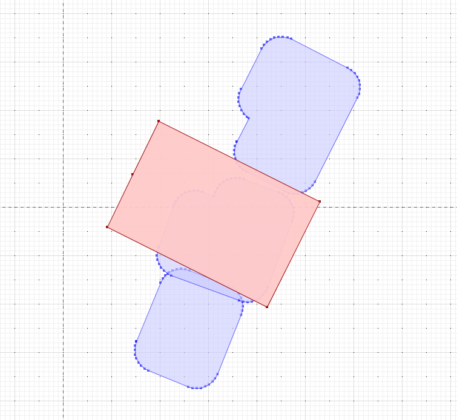
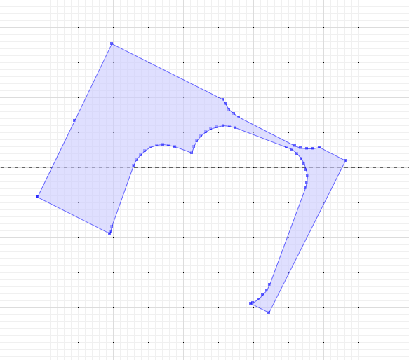

# Burlington Tiny Home Parcel Calculation Project

We're trying to figure out how many parcels in the NNE of Burlington VT have backyards small enough to fit a minimum size 350 sqft tiny home on them, taking into account setbacks, and the fact that parcels are not always rectangular. We will use this information to argue with the Planning Commission that zoning needs to be changed to allow tiny homes in the NNE and beyond.

## What Has Alex Done So Far?

He's downloaded the parcel data (`Tax_Parcels.geojson`) from data.burlingtonvt.gov and verified that his parcel exists. He's also downloaded Vermont building structure geometry data (`Vermont.geojson`) and found that the `162116` index of the `features` array contains his home. So this verifies that these two geojson's together can help us figure out how parcels and how size of backyards.

## Work To Do

[ ] Determine the boundaries for the NNE (i.e. a set of coordinates) and bound the parcel data to that area.

[ ] Write a function that, given a parcel and its coordinates from `Tax_Parcels.geojson`, returns the building structure in `Vermont.geojson` that is on that parcel. This will allow us to determine the size of the backyard for that parcel by subtracking out the structure, and using the placement of the structure to determine what the frontyard is, and remove that.

[ ] Write a function that, given a backyard size, returns whether or not it is large enough to fit a 350 sqft tiny home.

[ ] Finally, iterate through all of the parcels in `Tax_Parcels.geojson` and determine how many of them have backyards large enough to fit a 350 sqft tiny home. Also include what percentage of the total number of parcels have backyards large enough to fit a 350 sqft tiny home.

## initial exploration

tools needed:
    docker
    ogr2ogr

create a database:
```bash
docker run --rm -d --name btv_tiny_homes -p 6543:5432 -v $(pwd)/pgdata:/tmp/pgdata -e POSTGRES_PASSWORD=postgres -e PGDATA=/tmp/pgdata postgis/postgis:latest
```

the data directory is mounted locally, so data will persist across database start / stops. there's a better way to do this with docker volumes, 
but this is what I know how to do without querying any external source of knowledge.

Find the extent of the tax parcels data so we can use that to clip the buildings data to only relevant ones:

```bash
ogrinfo Tax_Parcels.geojson TaxParcel -so
INFO: Open of `Tax_Parcels.geojson'
      using driver `GeoJSON' successful.

Layer name: TaxParcel
Geometry: Multi Polygon
Feature Count: 8746
Extent: (-73.277012, 44.445915) - (-73.175797, 44.539938)
Layer SRS WKT:
GEOGCRS["WGS 84",
    DATUM["World Geodetic System 1984",
        ELLIPSOID["WGS 84",6378137,298.257223563,
            LENGTHUNIT["metre",1]]],
    PRIMEM["Greenwich",0,
        ANGLEUNIT["degree",0.0174532925199433]],
    CS[ellipsoidal,2],
        AXIS["geodetic latitude (Lat)",north,
            ORDER[1],
            ANGLEUNIT["degree",0.0174532925199433]],
        AXIS["geodetic longitude (Lon)",east,
            ORDER[2],
            ANGLEUNIT["degree",0.0174532925199433]],
    ID["EPSG",4326]]
Data axis to CRS axis mapping: 2,1
OBJECTID: Integer (0.0)
SITEADDRESS: String (0.0)
MAPLOTNO: String (0.0)
ST_NUM: Integer (0.0)
ST_NAME: String (0.0)
ST_TYPE: String (0.0)
PIN: Real (0.0)
created_user: String (0.0)
created_date: DateTime (0.0)
last_edited_user: String (0.0)
last_edited_date: DateTime (0.0)
UniqueId: Real (0.0)
SHAPE_Length: Real (0.0)
SHAPE_Area: Real (0.0)
```

clip the buildings dataset and project to [UTM zone 19](https://epsg.io/26919) so that we can use meters for calculations and check it

```bash
ogr2ogr -f GeoJSON new_north_end_buildings.geojson Vermont.geojson -spat -73.277012 44.445915 -73.175797 44.539938 -to_srs EPSG:26919

ogrinfo new_north_end_buildings.geojson Vermont -so
INFO: Open of `new_north_end_buildings.geojson'
      using driver `GeoJSON' successful.

Layer name: Vermont
Geometry: Polygon
Feature Count: 12901
Extent: (159767.118914, 4929895.999377) - (168254.831736, 4940767.316282)
Layer SRS WKT:
PROJCRS["NAD83 / UTM zone 19N",
    BASEGEOGCRS["NAD83",
        DATUM["North American Datum 1983",
            ELLIPSOID["GRS 1980",6378137,298.257222101,
                LENGTHUNIT["metre",1]]],
        PRIMEM["Greenwich",0,
            ANGLEUNIT["degree",0.0174532925199433]],
        ID["EPSG",4269]],
    CONVERSION["UTM zone 19N",
        METHOD["Transverse Mercator",
            ID["EPSG",9807]],
        PARAMETER["Latitude of natural origin",0,
            ANGLEUNIT["degree",0.0174532925199433],
            ID["EPSG",8801]],
        PARAMETER["Longitude of natural origin",-69,
            ANGLEUNIT["degree",0.0174532925199433],
            ID["EPSG",8802]],
        PARAMETER["Scale factor at natural origin",0.9996,
            SCALEUNIT["unity",1],
            ID["EPSG",8805]],
        PARAMETER["False easting",500000,
            LENGTHUNIT["metre",1],
            ID["EPSG",8806]],
        PARAMETER["False northing",0,
            LENGTHUNIT["metre",1],
            ID["EPSG",8807]]],
    CS[Cartesian,2],
        AXIS["(E)",east,
            ORDER[1],
            LENGTHUNIT["metre",1]],
        AXIS["(N)",north,
            ORDER[2],
            LENGTHUNIT["metre",1]],
    USAGE[
        SCOPE["Engineering survey, topographic mapping."],
        AREA["North America - between 72°W and 66°W - onshore and offshore. Canada - Labrador; New Brunswick; Nova Scotia; Nunavut; Quebec. Puerto Rico. United States (USA) - Connecticut; Maine; Massachusetts; New Hampshire; New York (Long Island); Rhode Island; Vermont."],
        BBOX[14.92,-72,84,-66]],
    ID["EPSG",26919]]
Data axis to CRS axis mapping: 1,2
release: Integer (0.0)
capture_dates_range: String (0.0)
```

reproject tax parcels to utm as well

```bash
ogr2ogr -f GeoJSON parcels.geojson Tax_Parcels.geojson -t_srs EPSG:26919 

ogrinfo -so parcels.geojson TaxParcel
INFO: Open of `parcels.geojson'
      using driver `GeoJSON' successful.

Layer name: TaxParcel
Geometry: Multi Polygon
Feature Count: 8746
Extent: (160017.168255, 4930024.687609) - (167942.788714, 4940714.144427)
Layer SRS WKT:
PROJCRS["NAD83 / UTM zone 19N",
    BASEGEOGCRS["NAD83",
        DATUM["North American Datum 1983",
            ELLIPSOID["GRS 1980",6378137,298.257222101,
                LENGTHUNIT["metre",1]]],
        PRIMEM["Greenwich",0,
            ANGLEUNIT["degree",0.0174532925199433]],
        ID["EPSG",4269]],
    CONVERSION["UTM zone 19N",
        METHOD["Transverse Mercator",
            ID["EPSG",9807]],
        PARAMETER["Latitude of natural origin",0,
            ANGLEUNIT["degree",0.0174532925199433],
            ID["EPSG",8801]],
        PARAMETER["Longitude of natural origin",-69,
            ANGLEUNIT["degree",0.0174532925199433],
            ID["EPSG",8802]],
        PARAMETER["Scale factor at natural origin",0.9996,
            SCALEUNIT["unity",1],
            ID["EPSG",8805]],
        PARAMETER["False easting",500000,
            LENGTHUNIT["metre",1],
            ID["EPSG",8806]],
        PARAMETER["False northing",0,
            LENGTHUNIT["metre",1],
            ID["EPSG",8807]]],
    CS[Cartesian,2],
        AXIS["(E)",east,
            ORDER[1],
            LENGTHUNIT["metre",1]],
        AXIS["(N)",north,
            ORDER[2],
            LENGTHUNIT["metre",1]],
    USAGE[
        SCOPE["Engineering survey, topographic mapping."],
        AREA["North America - between 72°W and 66°W - onshore and offshore. Canada - Labrador; New Brunswick; Nova Scotia; Nunavut; Quebec. Puerto Rico. United States (USA) - Connecticut; Maine; Massachusetts; New Hampshire; New York (Long Island); Rhode Island; Vermont."],
        BBOX[14.92,-72,84,-66]],
    ID["EPSG",26919]]
Data axis to CRS axis mapping: 1,2
OBJECTID: Integer (0.0)
SITEADDRESS: String (0.0)
MAPLOTNO: String (0.0)
ST_NUM: Integer (0.0)
ST_NAME: String (0.0)
ST_TYPE: String (0.0)
PIN: Real (0.0)
created_user: String (0.0)
created_date: DateTime (0.0)
last_edited_user: String (0.0)
last_edited_date: DateTime (0.0)
UniqueId: Real (0.0)
SHAPE_Length: Real (0.0)
SHAPE_Area: Real (0.0)
```

load to postgres for further processing

```bash
ogr2ogr -f PostgreSQL PG:"host=localhost user=postgres password=postgres port=6543" parcels.geojson -nln new_north_end_parcels
ogr2ogr -f PostgreSQL PG:"host=localhost user=postgres password=postgres port=6543" new_north_end_buildings.geojson -nln new_north_end_buildings
```

add spatial indexes (might be overkill, habit for me)

```sql
create index on new_north_end_parcels using gist(wkb_geometry);
create index on new_north_end_buildings using gist(wkb_geometry);
```

create a layer of all buildings, buffered by 15ft (4.572m, the unit of our projection), to represent setbacks. 

```sql
create table buffered_buildings as select st_buffer(wkb_geometry, 4.572) as geom from new_north_end_buildings;
```

NOTE: if we need to handle setbacks from parcel lines, the next step would be to use a negative buffer to shrink the parcel polygons by that amount, 
representing a loss of available area in the parcel. but since we are just using buildings for now, this is enough.

quick check: see what alex's parcel looks like

```sql
select 
    st_astext(st_collect(geom)) as buildings, 
    st_astext(st_collect(wkb_geometry)) as parcels 
from buffered_buildings, new_north_end_parcels 
where st_intersects(buffered_buildings.geom, new_north_end_parcels.wkb_geometry) 
and siteaddress = '472 ETHAN ALLEN PKWY'
```



ok, looks good. we can see that both of his neighbors technically intersect with his parcels, and his / his southern neighbor's house could not be built with the modern rules. 

next, create a layer of parcels with the buffered buildings subtracted from them.

first try with alex's parcel:

```sql
    select st_astext(st_difference(new_north_end_parcels.wkb_geometry, st_union(buffered_buildings.geom))) as geom
from new_north_end_parcels, buffered_buildings
where st_intersects(buffered_buildings.geom, new_north_end_parcels.wkb_geometry)
    and siteaddress = '472 ETHAN ALLEN PKWY'
group by new_north_end_parcels.ogc_fid
```



looks good! make a layer

```sql
create table setback_parcels as
select
    st_astext(st_difference(st_makevalid(new_north_end_parcels.wkb_geometry), st_union(buffered_buildings.geom))) as geom,
    siteaddress,
    ogc_fid
from new_north_end_parcels, buffered_buildings
where st_intersects(buffered_buildings.geom, new_north_end_parcels.wkb_geometry)
group by new_north_end_parcels.ogc_fid
```

note: the `st_makevalid` is needed b/c some of the buildings are invalid polygons apparently. normally I'd clean that up but I don't think it matters much here.

ok, now the harder part is to figure out how to fit an interior rectangle to the parcel polygon. I think at this point this requires some additional research on my part, 
there might be an existing algorithm we can use, but most of them are about enclosing / enveloping a set of points, and what we want is to create the largest possible rectangle bounded by this set of points, without crossing any lines.

more later...
